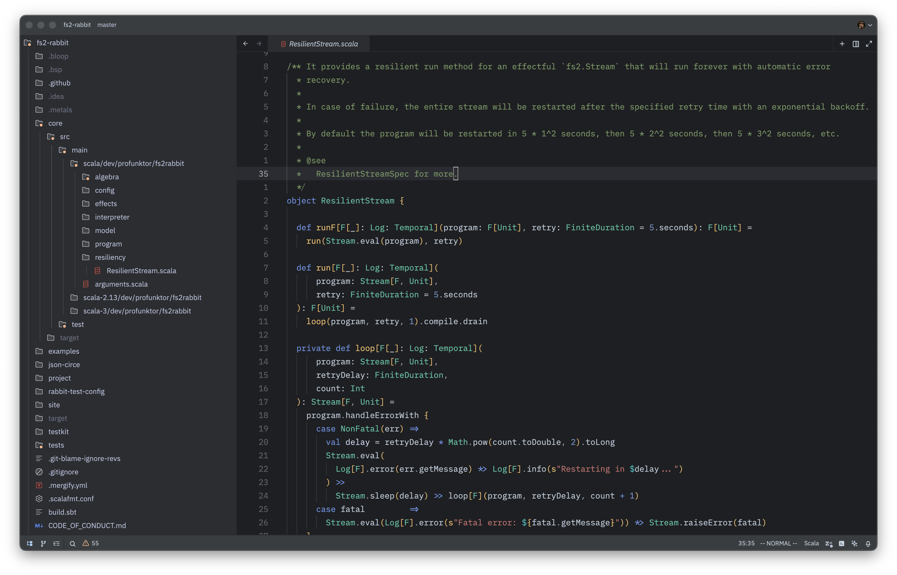

# BlackFox theme for [Zed](https://zed.dev/)

Color scheme inspired by Intellij Idea.

## How to install

- Open Zed
- `cmd+shift+p` (or just `:` if you have vim mode enabled) and select `zed: extensions`
- Select BlackFox Theme and Install
- (Optional) Install [JetBrains Icons](https://github.com/ziishaned/zed-jetbrains-icons)
